Report

# 1. Environment Setup
   Screenshot MLflow UI startup
   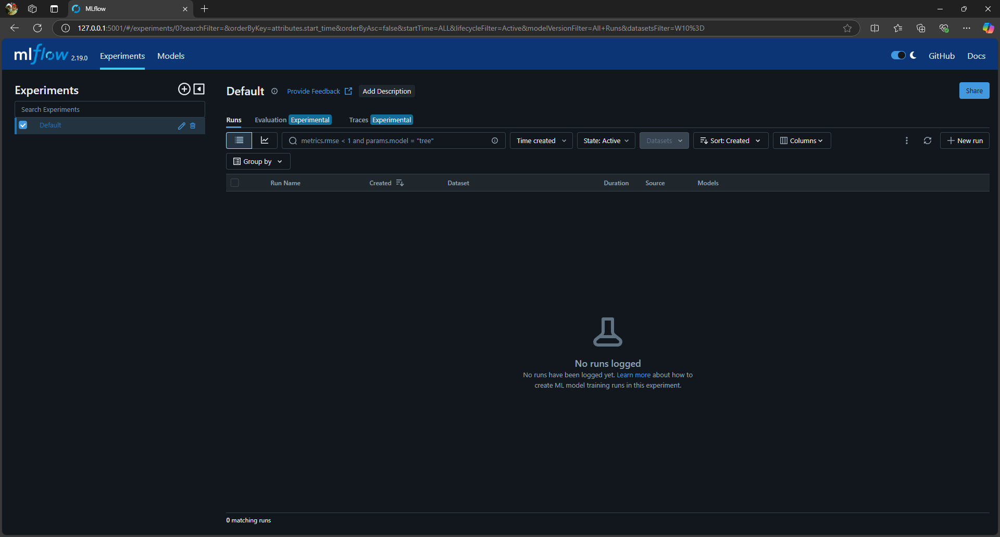
   List of Packages
   - mlflow
   - scikit-learn
   - pandas
   - numpy
   - dvc
   - fastapi
   - uvicorn
   - evidently

     
     

# 2. Task 1: Synthetic Data Results   
   Screenshot of model comparisons    
   a. Logistic Regression   
   accuracy = 0.725   
   auc_score = 0.7683293269230769
   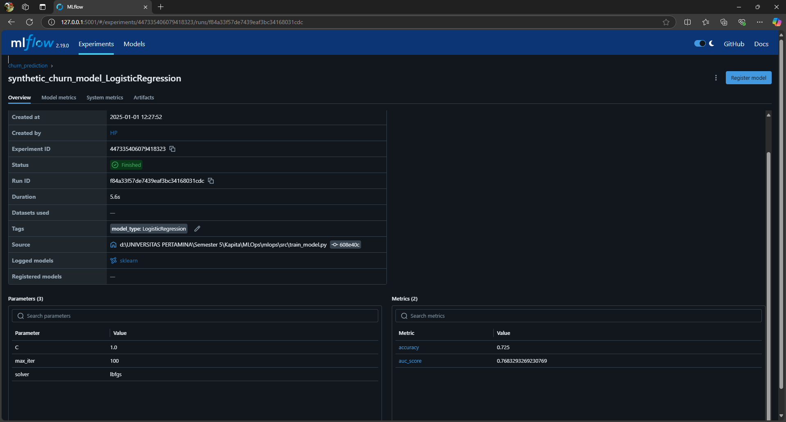
   b. Random Forest   
   accuracy = 0.67   
   auc score = 0.7346754807692308
   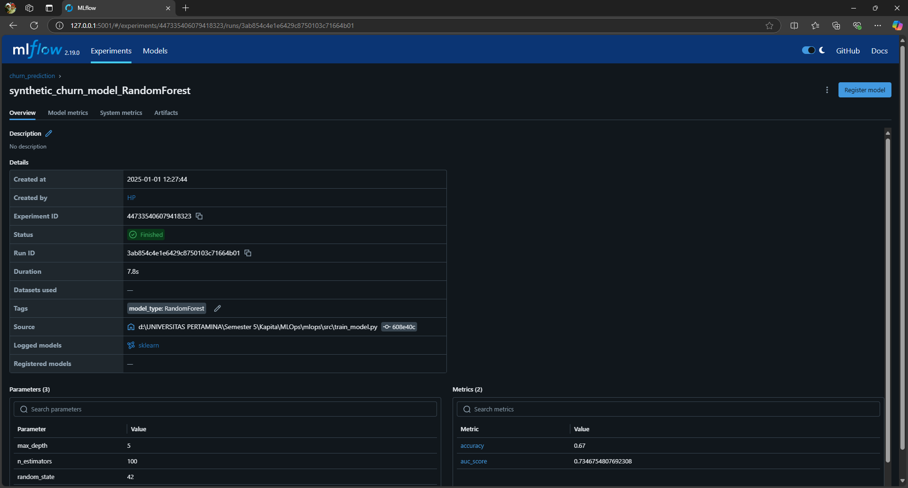

  ## Analisis:

   Logistic Regression menunjukkan akurasi yang lebih tinggi (0.725) dibandingkan dengan Random Forest (0.67). Ini berarti model Logistic Regression lebih efektif dalam memprediksi hasil yang benar secara keseluruhan pada data uji. Dengan kata lain, model ini memberikan    prediksi yang lebih tepat di sebagian besar kasus, meskipun ada kemungkinan bahwa ia gagal mengidentifikasi kelas dengan tingkat ketepatan yang sangat tinggi.

   AUC Score menunjukkan seberapa baik model dapat membedakan antara dua kelas (misalnya, churn atau tidak churn). Dalam hal ini, Logistic Regression juga memiliki AUC yang lebih tinggi (0.7683) dibandingkan dengan Random Forest (0.7347). AUC yang lebih tinggi              menunjukkan bahwa Logistic Regression lebih baik dalam membedakan antara kelas, yang berarti model ini memiliki kekuatan yang lebih besar dalam memprediksi dengan benar apakah suatu pelanggan akan churn atau tidak, bahkan dalam kasus yang lebih sulit (ketika kelas       tidak terdistribusi dengan seimbang atau terdapat noise dalam data).

   Mengapa Logistic Regression lebih baik dalam hal ini?

   Kesederhanaan Model: Logistic Regression mungkin bekerja lebih baik pada dataset ini karena data yang digunakan mungkin memiliki hubungan linier yang jelas antara fitur dan target. Model ini bekerja lebih baik ketika hubungan antara variabel independen dan dependen      bersifat linier.
   Regularisasi dan Generalisasi: Logistic Regression cenderung lebih teratur (regularized), menghindari overfitting pada data uji. Sementara Random Forest, meskipun sering lebih kuat untuk dataset yang kompleks, mungkin mengalami overfitting pada dataset ini karena        modelnya lebih kompleks dengan banyak pohon keputusan.

 ##  Pola yang Menarik:
   
   Akurasi vs AUC:
   Logistic Regression memiliki akurasi lebih tinggi (0.725), namun Random Forest sedikit lebih rendah (0.67). Ini bisa terjadi karena akurasi mengukur prediksi keseluruhan tanpa mempertimbangkan keseimbangan antara kelas.
   Sebaliknya, AUC menunjukkan kemampuan model untuk membedakan antara dua kelas, dan di sini, Logistic Regression memiliki AUC lebih tinggi, yang mengindikasikan bahwa meskipun Random Forest lebih rendah dalam akurasi, ia tidak mampu membedakan antara kelas dengan         sebaik Logistic Regression.
   Trade-off Model:
   Perbedaan ini menunjukkan trade-off antara dua metrik yang sering terjadi dalam machine learning: akurasi vs AUC. Model dengan akurasi tinggi mungkin hanya efektif untuk kasus-kasus yang lebih mudah (misalnya, lebih banyak prediksi benar pada kelas mayoritas),           sementara model dengan AUC lebih tinggi (seperti Logistic Regression) lebih baik dalam membedakan antara kelas meskipun memiliki akurasi lebih rendah secara keseluruhan.
   Overfitting pada Random Forest:
   Random Forest cenderung lebih canggih dan dapat menangani interaksi non-linier di antara fitur, tetapi dengan kompleksitas model yang lebih tinggi, ada potensi untuk overfitting, yang dapat mempengaruhi akurasi meskipun masih mampu memberikan AUC yang baik.

  ## Kesimpulan
   Secara keseluruhan, Logistic Regression menunjukkan kinerja lebih baik dalam membedakan kelas (AUC) dan memiliki akurasi yang lebih baik dalam hal prediksi keseluruhan. Hal ini mungkin disebabkan oleh sifat linier dataset yang lebih cocok dengan model tersebut.
   Random Forest, meskipun sering lebih kuat untuk menangani data kompleks, memiliki akurasi lebih rendah dan AUC yang sedikit lebih rendah, yang bisa jadi mengindikasikan bahwa model ini mungkin terlalu kompleks dan terpengaruh oleh overfitting pada dataset ini.

     
     

# 3. Task 2: Dataset Documentation
  Dataset yang saya pilih adalah dataset spam.csv yang diambil dari Kaggle. Dataset ini berisi 5,675 baris data email yang dapat dikategorikan ke dalam dua kategori: spam dan ham.  
  - Spam: Email yang tidak diinginkan atau sering dianggap sebagai pesan sampah.
  - Ham: Email yang dianggap sah dan bukan spam.
  Dataset ini berisi beberapa fitur yang dapat digunakan untuk membedakan antara email yang merupakan spam atau ham, seperti teks dalam subjek email dan konten pesan itu sendiri.  
  Fitur-fitur yang ada dalam dataset ini mencakup informasi terkait dengan isi pesan, yang dapat dianalisis untuk mengidentifikasi pola yang membedakan antara spam dan ham. Data ini cocok untuk diterapkan dalam model klasifikasi untuk mendeteksi apakah suatu email         termasuk dalam kategori spam atau bukan.   
  Screenshot
  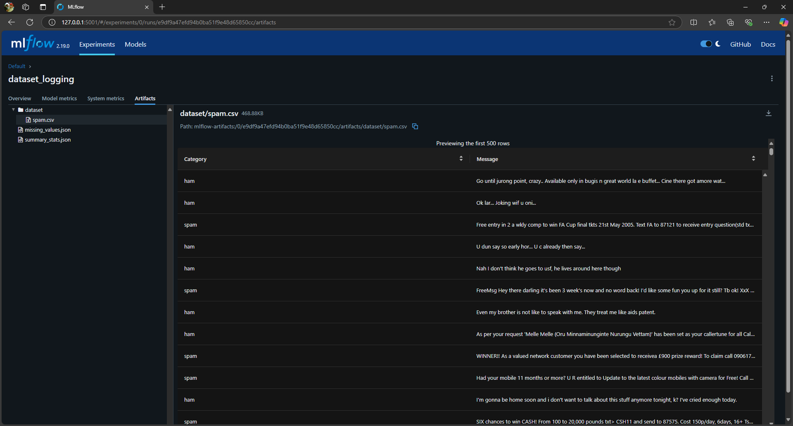
  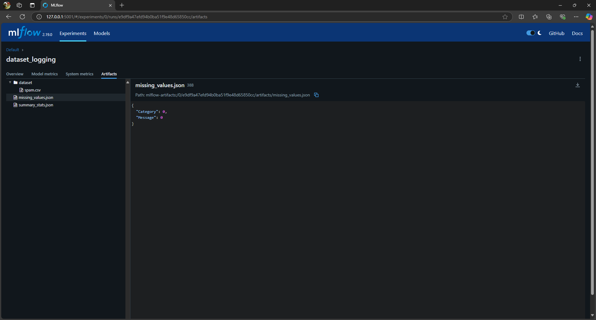
  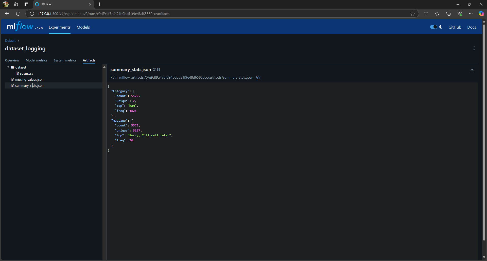
  No challange

     
     

# 4. Task 3: Custom Dataset Results
  ## Screenshot
   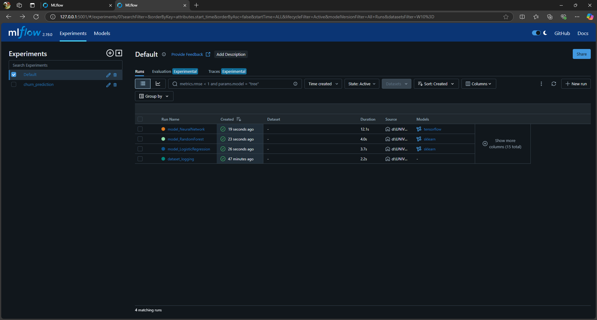
    
   ### Neural Network
   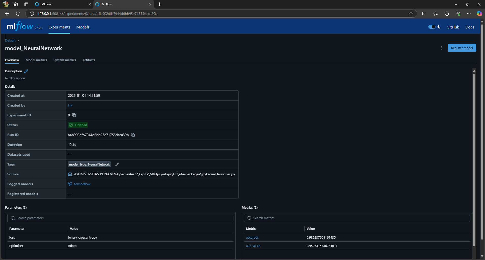
    
   ### Logistic Regression
   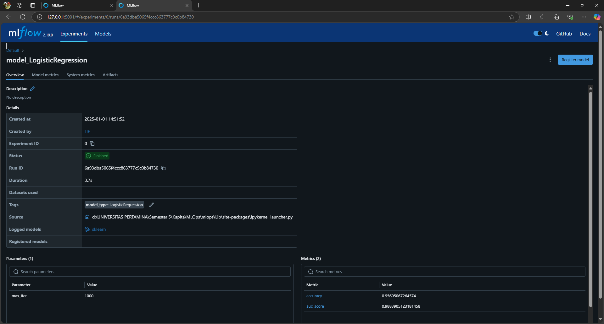
    
   ### Random Forest
   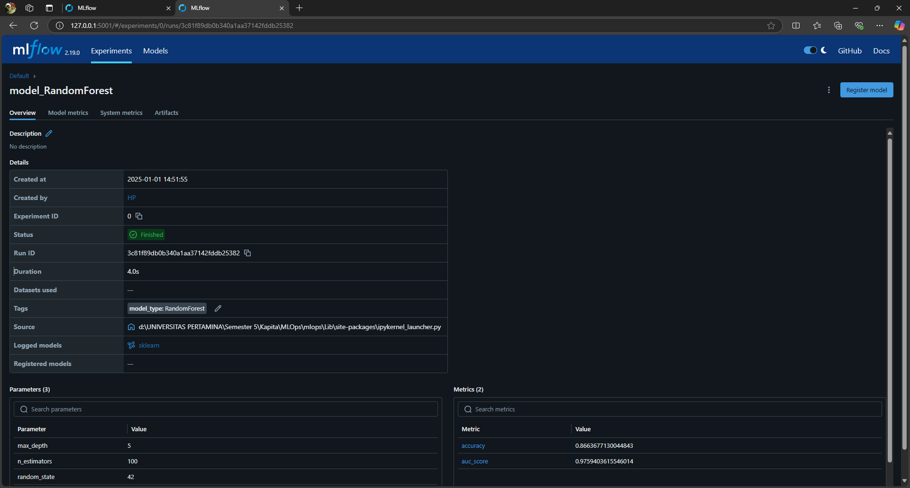
    
    
   ## Insight
   ### Neural Network Performance
   - Akurasi: 98.92%
   - AUC Score: 0.96  
   Neural Network menunjukkan akurasinya tertinggi dan AUC score yang sangat baik. Ini menunjukkan bahwa model ini bekerja sangat baik, kemungkinan karena kemampuannya untuk mempelajari pola-pola kompleks dalam data. AUC score yang relatif tinggi juga menunjukkan bahwa    model ini sangat baik dalam membedakan antara kelas-kelas yang ada.
   ### Logistic Regression Performance
   - Akurasi: 95.70%
   - AUC Score: 0.99  
   Logistic Regression bekerja cukup baik dengan akurasinya 95,7%, dan secara mengejutkan memiliki AUC score tertinggi (0.99). AUC score yang tinggi menunjukkan bahwa model ini memiliki kemampuan yang sangat baik dalam membedakan antara dua kelas, meskipun akurasinya      sedikit lebih rendah daripada Neural Network. Logistic Regression adalah model yang lebih sederhana, dan performanya menunjukkan bahwa hubungan antara fitur dan variabel target relatif linear atau mendekati linear.
   ### Random Forest Performance
   - Akurasi: 86.64%
   - AUC Score: 0.98  
   Random Forest menunjukkan akurasinya paling rendah yaitu 86.64%, namun tetap menunjukkan performa yang cukup baik dengan AUC score 0.98. Akurasi yang lebih rendah ini bisa menunjukkan bahwa Random Forest lebih rentan terhadap overfitting, terutama dengan kedalaman      pohon yang terbatas (max_depth=5). Namun, AUC score yang tinggi menunjukkan bahwa model ini masih bisa membedakan antara kelas dengan baik.
   ## Kesimpulan
   a. Akurasi vs. AUC: Neural Network memiliki akurasi terbaik, sedangkan Logistic Regression memiliki AUC score tertinggi. Model Random Forest meskipun memiliki akurasi lebih rendah, tetap menunjukkan performa yang baik dengan AUC score yang tinggi. AUC sering               dianggap sebagai metrik yang lebih baik untuk tugas klasifikasi, terutama jika ada ketidakseimbangan kelas, karena mengukur kemampuan model dalam mengurutkan prediksi dengan benar.

   b. Kompleksitas Model dan Performa: Neural Network tampaknya mendapatkan keuntungan dari kompleksitas dan kemampuannya dalam memodelkan hubungan non-linear. Namun, Logistic Regression, meskipun lebih sederhana, masih memberikan performa yang sangat baik dengan AUC         score yang sangat tinggi, menunjukkan bahwa masalah ini mungkin lebih sederhana dari yang diperkirakan.

   c. Risiko Overfitting pada Random Forest: Model Random Forest, dengan hyperparameter yang diberikan, tampaknya memiliki akurasi yang lebih rendah. Ini bisa jadi karena model tersebut overfit pada data pelatihan dengan struktur pohon yang dangkal (max_depth=5).             Meningkatkan max_depth atau menggunakan lebih banyak pohon (n_estimators) bisa meningkatkan performanya.
   ## Potential Next Step
   ### Tuning Hyperparameter:
   Untuk Random Forest, coba tingkatkan max_depth atau sesuaikan n_estimators untuk melihat apakah performa bisa ditingkatkan.
   Untuk Neural Network, pertimbangkan mencoba arsitektur yang berbeda (lebih banyak lapisan, neuron) atau teknik regularisasi (seperti dropout) untuk menghindari overfitting.
   ### Perbandingan Model:
   Karena model Logistic Regression memberikan AUC yang sangat tinggi, Anda bisa mempertimbangkan untuk menggunakan model ini untuk tugas klasifikasi yang memerlukan interpretabilitas. Sementara Neural Networks bisa dipilih jika akurasi yang lebih tinggi lebih             diutamakan.
   ### Rekayasa Fitur:
   Eksplorasi langkah-langkah rekayasa fitur tambahan, seperti memasukkan fitur spesifik domain atau melakukan pra-pemrosesan data yang lebih mendalam (misalnya, penskalaan fitur, penghapusan outlier) untuk meningkatkan performa model lebih lanjut.
   ## Comparison
   Hasil perbandingan antara model yang dilatih pada data nyata dan data sintetis menunjukkan bahwa meskipun model Neural Network memberikan akurasi yang sangat baik pada data nyata dengan nilai 98.92% dan AUC 95.97%, data sintetis memberikan hasil yang sedikit lebih      rendah pada model yang sama. Model Logistic Regression dan Random Forest menunjukkan performa yang cukup konsisten, namun pada data sintetis, kedua model tersebut memperoleh akurasi dan AUC yang sedikit lebih tinggi. Hal ini menunjukkan bahwa data sintetis cenderung    lebih terstruktur dan tidak mengandung variabilitas seperti pada data nyata, yang dapat menyebabkan model lebih mudah beradaptasi dan memberikan hasil yang lebih baik pada data sintetis. Meskipun demikian, performa model pada data nyata lebih mencerminkan kemampuan     model dalam menghadapi ketidakpastian dan kompleksitas dunia nyata.

     
     

   # 5. Task 4: Drift Detection
   ## Screenshots of MLflow tracking for drift detection
   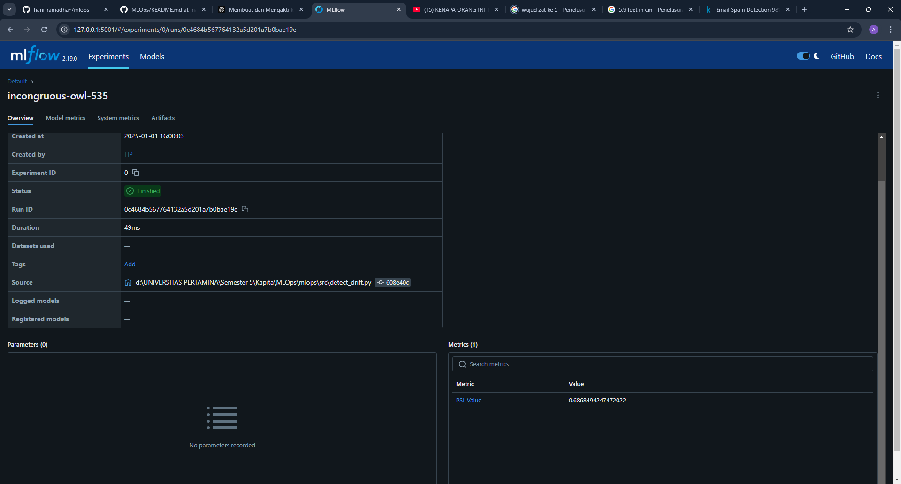
   ## Analisis
   Berdasarkan hasil deteksi drift yang diperoleh dengan perhitungan PSI (Population Stability Index) pada model, ditemukan nilai PSI sebesar 0.6868, yang termasuk dalam kategori *high drift*. Hal ini mengindikasikan adanya perbedaan signifikan antara distribusi data    ekspektasi (data pelatihan) dan distribusi data aktual yang digunakan untuk prediksi. Biasanya, nilai PSI di atas 0.2 menunjukkan perubahan yang cukup besar dalam karakteristik data, yang berpotensi memengaruhi kinerja model. 

   Analisis lebih lanjut terhadap distribusi data menunjukkan bahwa perubahan ini bisa disebabkan oleh beberapa faktor, seperti perubahan pola input data, pergeseran dalam sumber data, atau perubahan dalam kondisi lingkungan yang mempengaruhi data tersebut. Untuk          mengatasi drift ini, model mungkin perlu diperbarui dengan data terbaru atau pipeline data perlu disesuaikan agar dapat menangani perubahan tersebut. Pemantauan berkelanjutan terhadap model dan data sangat penting untuk memastikan bahwa model tetap relevan dan          akurat seiring waktu. 

   Secara keseluruhan, deteksi drift ini menunjukkan pentingnya untuk secara rutin memantau dan mengelola kualitas data yang digunakan dalam model, terutama ketika model dioperasikan dalam lingkungan yang dinamis atau mengalami perubahan dalam pola data.
   
   ## Setting Drift Parameter
   if psi < 0.1:
            drift_status = "No drift"
        elif 0.1 <= psi < 0.2:
            drift_status = "Moderate drift"
        else:
            drift_status = "High drift"
